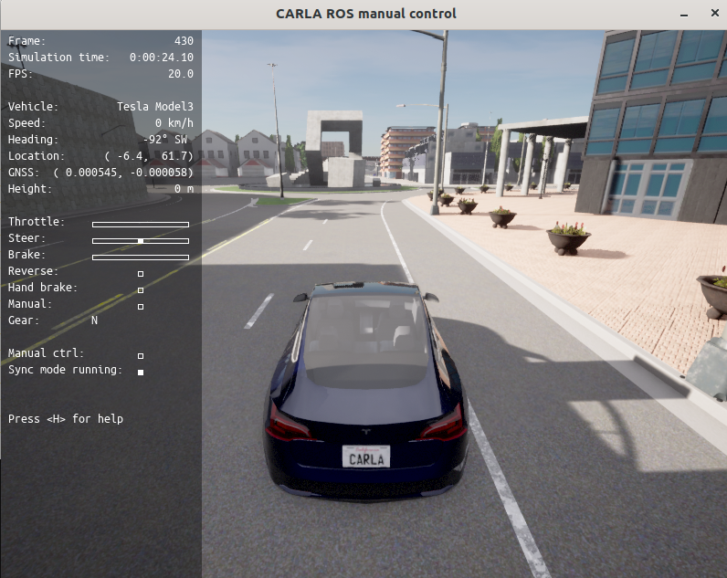

# Environmental requirements

# ros2
## create package
colcon build  --cmake-args
colcon build --event-handlers console_direct+ --cmake-args -DCMAKE_VERBOSE_MAKEFILE=ON
colcon build --packages-select vehicle control
=======
## create package
colcon build  --cmake-args
colcon build --event-handlers console_direct+ --cmake-args -DCMAKE_VERBOSE_MAKEFILE=ON

# Module
# carla 0.9.13colcon build --event-handlers console_direct+ --cmake-args -DCMAKE_VERBOSE_MAKEFILE=ON

## carla-ros-bridge

###

### ego_vehicle
~/lifanjie/carla-ros-bridge/src/ros-bridge/carla_spawn_objects/config/objects.json
"type": "vehicle.lincoln.mkz_2017",

## run pnc node
=======
##

cd ~/planning_and_control_study_by_carla 
source install/setup.bash
ros2 launch control control_with_planning.launch.py 

### modify parameter need rebuild 

## vehicle 
control comand to carla vehicle and get vehicle info from carla

## control
generate control command to control the vehicle

## planning

